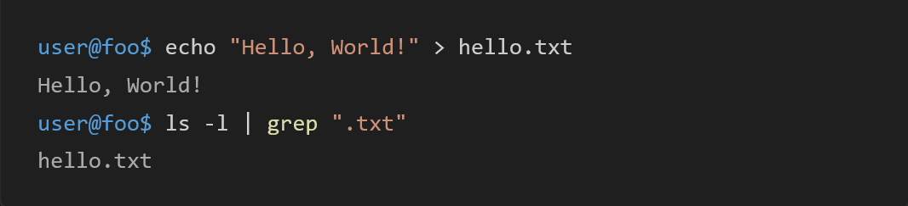
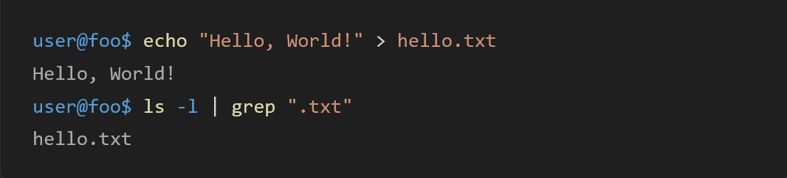

# shell-session-syntax

Grammar files for better syntax highlight of Shell Session. This repository provides a TextMate grammar file in JSON format for ``shellsession`` syntax highlighting.

I have merged the ``shellsession`` syntax used by GitHub and the powerful ``shellscript`` syntax used by VS Code.

## Why?

This project was created to more properly syntax highlight ``shellsession`` in [Shiki.js](https://shiki.style/).

The grammar file used by Shiki does not highlight the first command in Shell Session, but it is difficult to change the existing behavior for [several reasons](https://github.com/shikijs/textmate-grammars-themes/issues/43).

If you load shell-session-syntax as a custom language grammar in Shiki, you will get better syntax highlighting of ``shellsession``.

|Shiki's default syntax|shell-session-syntax|
|:---:|:---:|
|||

This project automatically generates the grammar file. It uses [better-shell-syntax](https://github.com/jeff-hykin/better-shell-syntax/blob/master/autogenerated/shell.tmLanguage.json) for Shell grammar and [Linguist](https://github.com/github-linguist/linguist/) for Shell Session grammar. When merging these grammars, some patches are automatically applied.

## Usage

To use shell-session-syntax in Shiki, please download ``./syntaxes/shell-session.tmLanguage.json`` and load it as a custom language grammar. It automatically overwrites the default ``shellsession`` grammar.

```javascript
import { getHighlighter } from "shiki";
import shellSession from "./shell-session.tmLanguage.json" assert { type: "json" };

const code = `
user@foo$ echo "Hello, World!" > hello.txt
Hello, World!
user@foo$ ls -l | grep ".txt"
hello.txt
`.trim();

const highlighter = await getHighlighter({
    langs: [shellSession],
    themes: ["vitesse-dark"]
});

const html = highlighter.codeToHtml(code, {
    lang: "shellsession",
    theme: "vitesse-dark"
});

console.log(html);
```

## Update Grammar

To update the grammar file, run the following command. It automatically downloads the latest upstream grammar files and applies patches.

```bash
npm run build
```

## Grammar Sources

shell-session-syntax is generated by automatically applying patches to the following grammar files and merging them.

- [better-shell-syntax](https://github.com/jeff-hykin/better-shell-syntax) ([MIT License](https://github.com/jeff-hykin/better-shell-syntax/blob/master/LICENSE))
- [Linguist](https://github.com/github-linguist/linguist/) ([MIT License](https://github.com/github-linguist/linguist/blob/master/LICENSE))
